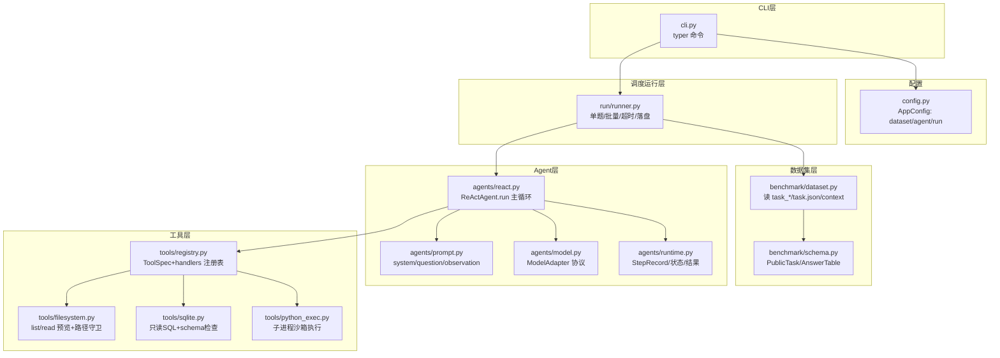
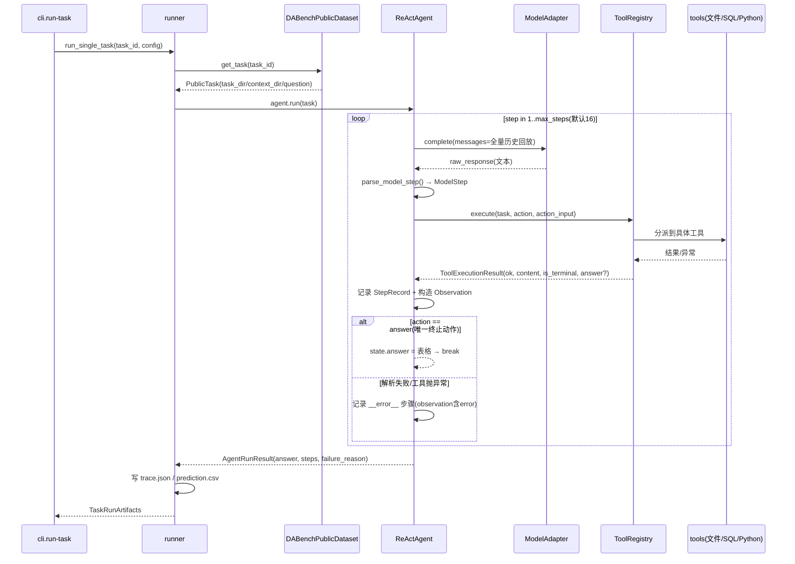

# 官方 REACT 模型拆解（PHASE_1 starter kit）

> **定位**：专拆官方 REACT baseline 的「代码架构 + 设计思路 + 任务拆解机制」，作为自研 agent 的参照物。
> **与 `../baseline/` 的关系**：那边回答"官方 starter kit 怎么跑起来、每块模块细节"；本篇回答"REACT 模型本身是怎么设计的、任务到底是怎么被一步步拆完的"。
> **源码基准**：`code/competitions/kddcup2026-data-agents-starter-kit/PHASE_1/`（包名 `data_agent_baseline`）
> **一句话**：官方 REACT 是**零框架**的 ReAct 循环——LLM 每步只输出一个 `{thought, action, action_input}` JSON，框架替它执行工具并把观察结果回灌，直到它调用 `answer`。

---

## 1. 先建立背景：REACT 范式是什么

ReAct（Reasoning + Acting，Yao et al., 2022）的核心是让 LLM 的**推理**与**行动**交替进行：

| 环节                | 含义                                         | 官方实现里的对应                        |
| ------------------- | -------------------------------------------- | --------------------------------------- |
| Thought（思考）     | 说明"我现在知道什么、还缺什么、下一步做什么" | JSON 里的`thought` 字段               |
| Action（行动）      | 调用一个外部工具去获取信息 / 执行计算        | JSON 里的`action` + `action_input`  |
| Observation（观察） | 工具返回的真实结果，作为下一轮思考的输入     | 每步工具结果包装成`Observation:` 回灌 |

对比两种"单极"方案，REACT 的位置就清楚了：

- **纯 CoT**：只推理、不行动 → 无法接触任务真实数据，凭幻觉答题；
- **纯工具调用**：只行动、不推理 → 不知道下一步该查什么、为什么要查；
- **REACT**：推理指导行动（决定查什么），行动结果修正推理（看到数据后调整判断）——**边想边做、用观察接地气**。

官方 baseline 就是 REACT 的一个最小可行实现：**没有 agent 框架**，核心主循环就一个 `for`，其余全靠「提示词约束 + 8 个工具 + 结果回灌」撑起来。

---

## 2. 代码架构拆解

### 2.1 顶层视角：谁调用谁



### 2.2 包结构与职责（按依赖方向自下而上）

| 文件                     | 一句话职责                           | 关键类型 / 函数                                                                             |
| ------------------------ | ------------------------------------ | ------------------------------------------------------------------------------------------- |
| `benchmark/schema.py`  | 领域数据模型                         | `PublicTask`(record+assets)、`TaskRecord`、`TaskAssets`、`AnswerTable`              |
| `benchmark/dataset.py` | 从磁盘加载公开任务                   | `DABenchPublicDataset`：`get_task` / `iter_tasks`（可过滤难度）                       |
| `agents/model.py`      | 模型接入抽象                         | `ModelAdapter`(Protocol) → `OpenAIModelAdapter` / `ScriptedModelAdapter`(测试用)     |
| `agents/prompt.py`     | 三层提示词组装                       | `REACT_SYSTEM_PROMPT`、`RESPONSE_EXAMPLES`、`build_system/task/observation_prompt`    |
| `agents/runtime.py`    | Agent 运行态与产物                   | `StepRecord`、`AgentRuntimeState`、`AgentRunResult`                                   |
| `agents/react.py`      | **REACT 主循环（本拆解核心）** | `ReActAgent.run`、`parse_model_step`                                                    |
| `tools/registry.py`    | 工具注册表与分派                     | `ToolRegistry`、`ToolSpec`、`ToolExecutionResult`、`create_default_tool_registry()` |
| `tools/filesystem.py`  | context 只读访问                     | `resolve_context_path`(路径逃逸守卫)、`list_context_tree`、`read_*_preview`           |
| `tools/sqlite.py`      | SQLite 只读能力                      | `_connect_read_only`(mode=ro)、`inspect_sqlite_schema`、`execute_read_only_sql`       |
| `tools/python_exec.py` | Python 沙箱执行                      | `execute_python_code`(子进程+流捕获+30s 超时)                                             |
| `run/runner.py`        | 编排/超时/产物落盘                   | `run_single_task`、`run_benchmark`、`_run_single_task_with_timeout`                   |
| `config.py`            | YAML→dataclass                      | `AppConfig(DatasetConfig, AgentConfig, RunConfig)`                                        |
| `cli.py`               | 命令行入口                           | `status` / `inspect-task` / `run-task` / `run-benchmark`                            |

> 关键设计：**各层之间是"纯函数式"单向依赖**，越往上越薄。Agent 不知道数据在磁盘上怎么组织，tools 不知道 LLM 是什么，runner 只负责调度与落盘——替换任何一层都不影响其他层（例如换模型只需实现 `ModelAdapter`）。

### 2.3 核心数据流（一次 run-task 全链路）



### 2.4 REACT 主循环逐段解读（`agents/react.py`）

核心就在两个函数里：

**① `parse_model_step(raw_response)` → `ModelStep`**（宽容式解析）

```
_strip_json_fence():  去掉 ```json ... ``` 围栏（兼容无 json 标签的围栏）
_load_single_json_object(): 严格单对象：raw_decode 取第一个 JSON，
    若后面还有非空残留 → 抛错（要求一次只回一个对象）
字段校验：thought 必须字符串 / action 必须非空字符串 / action_input 必须 dict
```

→ 每个**违反协议**的点都直接抛 `ValueError`，由主循环捕获成 `__error__` 观察回灌，让模型自己改正（详见 3.4）。

**② `ReActAgent.run(task)` → `AgentRunResult`**（状态机本质）

- 状态只有三样（`AgentRuntimeState`）：`steps`（轨迹）、`answer`（终态表格）、`failure_reason`；
- 每步：`_build_messages()` 把**全部历史**重放给模型 → `model.complete()` → 解析 → 执行工具 → 记录 `StepRecord`；
- 两个出口：① 工具返回 `is_terminal=True`（即 `answer` 被成功调用）→ 存答案并退出；② `max_steps`(16) 耗尽 → `failure_reason = "Agent did not submit an answer within max_steps."`；
- **任何异常**（解析失败、未知工具、参数错误、工具内部报错）都被捕获，作为 `observation={"ok": False, "error": ...}` 记入一步（action 记为 `__error__`），**循环继续**——错误本身成为模型下一轮的输入。

> 也就是说：官方 agent 的"自我修正"不靠独立的纠错模块，而是**把错误当成一种观察结果喂回给 LLM**。模型是否真能改对，官方并不保证——这是"信任模型自律"的设计。

### 2.5 消息结构：全量历史回放（`_build_messages`）

每次调模型前拼出的 messages 为：

```
system:  REACT_SYSTEM_PROMPT + 8个工具描述(input_schema) + 两个JSON示例
user:    Question: <task.question>  （+ "文件路径相对 context" 说明）
--- 以下随 steps 数线性增长 ---
assistant: step1 的 raw_response（原文，不做任何截断/改写）
user:      Observation: {"ok":..,"tool":..,"content":..}
assistant: step2 的 raw_response
user:      Observation: {...}
...
```

含义与代价：

- **无状态、可重放**：agent 自己不维护"记忆"，全部上下文靠重放消息获得 → 简单可靠，中途崩溃可复现；
- **线性膨胀**：每步的 assistant 原文 + observation 全量回灌，17 步即约 15K tokens（本机实测），是长任务的首要工程瓶颈 → 对应 v0.2 的 observation 截断策略。

---

## 3. 思路设计：每个"选择"背后的取舍

| #  | 设计点                       | 官方怎么做的                                                        | 为什么                                                                          | 代价 / 局限                                                                  |
| -- | ---------------------------- | ------------------------------------------------------------------- | ------------------------------------------------------------------------------- | ---------------------------------------------------------------------------- |
| 1  | **零框架**             | 不引 agent 框架，主循环自己写                                       | 逻辑透明、可移植、无黑盒                                                        | 抗故障/记忆/规划能力都要自己补                                               |
| 2  | **文本 JSON 协议**     | 让模型输出 ```json 围栏的`{thought, action, action_input}`        | 任意 OpenAI 兼容模型都能用（DeepSeek/千问都能跑），不需要 function calling 支持 | 引入解析故障（围栏丢失、多余文本、多对象等）→ 官方用宽容解析+error 回灌兜底 |
| 3  | **每步只允许一个动作** | 一步 = thought + 单 action                                          | 协议极简、轨迹可审计                                                            | 无法表达"并行探索"或显式分支计划                                             |
| 4  | **全量历史回放**       | messages 把每一步 raw_response 原样重发                             | 无状态、无压缩损失                                                              | 上下文线性膨胀                                                               |
| 5  | **错误即观察**         | 解析/工具错误都作为 observation 回灌                                | 给模型"自纠"机会，无需独立纠错模块                                              | 依赖模型自律；反复错会白烧步数预算                                           |
| 6  | **answer 是唯一终态**  | 只有调用`answer` 工具才算完成；且校验 columns/rows 形状           | 把"任务完成"绑定到工具调用，杜绝模型"空谈结束"                                  | 无答案质量校验——答错也算"完成"                                             |
| 7  | **双层兜底**           | agent 内`max_steps=16`；runner 外再包进程级 `task_timeout=600s` | 防模型死循环/长工具挂死                                                         | 兜底不等于质量控制                                                           |
| 8  | **工具安全边界**       | 路径逃逸守卫 + SQL 只读 + Python 子进程 30s 超时                    | 模型可能乱来，护栏必须落在执行层                                                | Python 只是"超时+隔离"，并非真沙箱                                           |
| 9  | **工具一律预览**       | read_csv 默认 20 行、read_json/doc 默认 4000 字符                   | 控制单次 observation 体积                                                       | 信息可能不足 → 需多次采样，消耗步数                                         |
| 10 | **评测独立**           | agent 只落 prediction.csv；gold 对照在评测端                        | 训练/推理与评测解耦                                                             | 本地跑分需要额外评测脚本                                                     |

下面挑最影响"任务拆解"的几条展开：

### 3.1 工具注册表：`ToolSpec` + handler 的"能力即描述"

`registry.py` 里每种工具同时有**给模型看的声明**（`name/description/input_schema`，会被拼进 system prompt）和**给代码执行的分派 handler**。模型看到的"工具菜单"完全来自 `describe_for_prompt()`——**加工具 = 加一条 spec + 一个 handler，零框架改动**。这是官方最值得继承的抽象。

### 3.2 工具安全三防线（不信任模型的防线）

1. **文件系统**（`filesystem.resolve_context_path`）：任何相对路径先 `.resolve()`，若不在 `context_dir` 内直接 `ValueError`——模型拿不到 context 之外的任何文件；
2. **SQLite**（`sqlite.py`）：连接用 `file:...?mode=ro`（只读 URI），且 SQL 文本必须以 `select/with/pragma` 开头，否则拒绝——**只能查不能写**；
3. **Python**（`python_exec.py`）：代码在**独立子进程**执行，临时文件捕获 stdout/stderr，`join(timeout=30)`，超时 `terminate`→`kill`。cwd 切到 context 根，命名空间只注入 `context_root` 与 `Path`。

> 设计哲学：**模型是不可信输入**。官方把"防越界"放在执行层强制拦，而不是靠 prompt 规劝。这套"护栏下沉"的思路自研时必须保留。

### 3.3 `answer` 的校验即输出守卫

`_answer()` 是唯一 `is_terminal=True` 的工具。它对模型输入做形状校验：

- `columns` 必须是非空字符串列表；
- `rows` 必须是列表，且每行长度必须等于列数（矩形表）；
- 通过校验 → 生成 `AnswerTable`，agent 结束。

这是"fail-closed"的最原始形态：**格式不合格就报错回灌，不让脏答案流出去**。官方只守了形状，没守"列是不是多余的"——那正是评分公式会罚的分（Recall − 0.5×ExtraCol/PredCol），也是自研 `VERIFY` 阶段要补的。

### 3.4 解析宽容度与 `__error__` 机制

官方模型协议解析（`parse_model_step`）做了三层宽容：

1. 接受带/不带 `json` 标签的代码围栏；
2. `json.JSONDecoder.raw_decode` 容忍字符串里的转义残留；
3. 解析失败不终止，变成一步 `__error__` 观察。

代价是：**一旦模型连续几轮输出非法 JSON，步数预算就被空转烧掉**。我们 v0.1 改用 Function Calling 的动机之一就是"让结构由 API 保证，而非靠模型自律"。

---

## 4. 任务是怎么被拆解的（本拆解的核心章节）

### 4.1 先给结论

> 官方 REACT **代码里没有任何 planner / plan 对象 / 子任务管理器 / 阶段状态机**。
> 任务拆解**不发生在代码层，而发生在模型的 `thought` 里**——每步 `thought` 就是一次"隐性任务分解 + 下一步决策"。

官方把"把大问题拆成小步骤"这件事**完全交给 LLM 的自由推理**，框架只提供三样东西：

- **规则提示**：system prompt 的第 1~4 条（先 inspect、只用观察到的、只有 `answer` 算完成、answer 要表格）；
- **工具菜单**：8 个工具的 description + input_schema，让模型知道"能做什么"；
- **观察回灌**：每步真实结果，作为下一步推理的事实基础。

### 4.2 隐性拆解实际发生的形态

对每个 task，模型拿到的初始信息只有 `Question` + 工具描述，**对数据一无所知**。因此它的轨迹天然是一个"探索→理解→计算→作答"的渐进过程，每步只做一个动作：

| 阶段             | 模型 thought 里在做什么          | 对应工具动作                                                            |
| ---------------- | -------------------------------- | ----------------------------------------------------------------------- |
| ① 摸清环境      | "先看看 context 里有什么文件"    | `list_context`                                                        |
| ② 读取结构      | "看看表结构 / 文件格式"          | `inspect_sqlite_schema` / `read_csv` / `read_json` / `read_doc` |
| ③ 定向查询      | "SQL join 两个表算平均……"      | `execute_context_sql`                                                 |
| ④ 复杂计算/验证 | "pandas 分组统计更稳"            | `execute_python`                                                      |
| ⑤ 汇总结案      | "把结果整理成 columns+rows 表格" | `answer`（唯一终止）                                                  |

> 注意：这个"阶段序列"**不是代码写死的**，而是模型根据每步 observation 自行涌现的模式。框架从不检查它现在处于哪个阶段、下一步该不该进入某阶段——**没有门控，全凭自律**。

### 4.3 拆解的"粒度"与"规划范围"

- **粒度**：一步 = 一次 thought + 一个 action。官方刻意不做"一次规划多步"或"子任务队列"；
- **规划范围**：thought 通常只"看一步"（我下一步该查什么）。**没有全任务的前瞻计划**，也就不存在"计划变更/计划回滚"；
- **是否保证收敛到原问题**：不保证。模型可能在中途**漂移**——比如查到一半忘了原始 question，或过早 `answer`。官方用 `max_steps` 硬截断，而不是"检测到漂移就拉回"。

### 4.4 官方对"拆解质量"的控制手段：几乎没有

| 官方没有的                                  | 官方有的替代 |
| ------------------------------------------- | ------------ |
| 计划校验（拆解是否覆盖问题要素）            | 无           |
| 阶段性验收（EXPLORE 是否足够才允许 ANSWER） | 无           |
| 步数预算内进度监控                          | 无           |
| 答案与问题一致性检查                        | 无           |

官方仅有的"控制"是：`max_steps`(16) 截断 + `task_timeout`(600s) + `answer` 形状校验。**这三个都是"兜底"而非"质量"**。这就是为什么 demo 上官方裸 baseline 只有 micro≈0.376、perfect 率 ~16%——不是模型不够强，而是**任务拆解质量没有被结构性保障**。

### 4.5 隐性拆解的典型失败模式（在 trace.json 里能看到）

| 失败模式   | 现象                                         | 根因（设计层）                                |
| ---------- | -------------------------------------------- | --------------------------------------------- |
| 过早作答   | 2~3 步就`answer`，列/值明显不全            | 无 EXPLORE 达标门控                           |
| 卡死绕圈   | 连续多步同一个动作反复看同一文件             | 无去重/无进度检测，observation 只是回灌不比对 |
| 错误烧预算 | 连续`__error__`（解析/工具错）直到步数耗尽 | 错误回灌依赖模型自律改正                      |
| 上下文漂移 | 后期 thought 与最初 question 脱节            | 无任务指针/todo，全凭模型"记得"               |
| 上下文遗忘 | 长任务早期 observation 被新内容挤出注意力    | 全量重放虽在，但超长后模型注意力失效          |

> 这些失败模式的共同来源，是官方把"拆解+规划+校验"三重职责**全部压给每步的 thought 自由发挥**。冠军方案（PLAN→EXPLORE→ANSWER→VERIFY）就是针对性地把这些职责**从 thought 里拿出来、变成显式的阶段与门控**——这正是我们 v0.3 显式规划、远期四阶段架构要补的洞。

### 4.6 隐性拆解 vs 显式规划的对照（自研演进的方向）

| 维度                 | 官方 REACT（隐性拆解）           | 显式规划（自研方向）                   |
| -------------------- | -------------------------------- | -------------------------------------- |
| 计划在哪             | 模型的 thought（不落盘、不复用） | 独立 plan 结构（可见、可审计、可修改） |
| 谁来保证覆盖问题要素 | 无人                             | 规划器 + 检查器                        |
| 阶段推进             | 自由漂移                         | 门控：上阶段达标才进下阶段             |
| 中途错误恢复         | 模型自觉                         | 结构化重试 / 计划修正                  |
| 对模型的依赖         | 极高（推理强则分高）             | 降低（工程质量兜底）                   |

---

## 5. 对自研 agent 路线的映射（简短）

| 官方特性                            | 自研版本怎么处理                                                     | 对应版本 |
| ----------------------------------- | -------------------------------------------------------------------- | -------- |
| 文本 JSON 协议                      | 换成**Function Calling**，结构由 API 保证 → 消灭 6 类解析故障 | v0.1     |
| 工具注册表/安全护栏/answer 矩形校验 | **保留并继承**（加 schema 摘要工具）                           | v0.1     |
| observation 全量回灌（线性膨胀）    | 加**observation 截断/摘要策略**                                | v0.2     |
| 隐性拆解（thought 里自由发挥）      | 先产出**显式计划**再执行                                       | v0.3     |
| 无阶段门控 / 无答案校验             | 补`VERIFY`（列数/形状 fail-closed 输出守卫）                       | 远期     |
| 无并行、无进度监控                  | 阶段性收敛到 PLAN→EXPLORE→ANSWER→VERIFY                           | 远期     |

---

## 6. 源码速查地图（想深挖时按图索骥）

| 想知道什么                                | 去哪里看                                                                                                                    |
| ----------------------------------------- | --------------------------------------------------------------------------------------------------------------------------- |
| REACT 主循环怎么写的                      | `agents/react.py::ReActAgent.run`、`parse_model_step`                                                                   |
| 模型协议解析的宽容度                      | `agents/react.py::_strip_json_fence`、`_load_single_json_object`                                                        |
| 每轮消息怎么拼（线性膨胀根源）            | `agents/react.py::_build_messages`                                                                                        |
| 规则与示例提示词原文                      | `agents/prompt.py::REACT_SYSTEM_PROMPT`、`RESPONSE_EXAMPLES`                                                            |
| 模型怎么接入（协议/OpenAI/测试替身）      | `agents/model.py`                                                                                                         |
| 8 个工具怎么注册与分派                    | `tools/registry.py::create_default_tool_registry`                                                                         |
| `answer` 的校验规则（fail-closed 雏形） | `tools/registry.py::_answer`                                                                                              |
| 路径逃逸/只读 SQL/Python 沙箱             | `tools/filesystem.py::resolve_context_path`、`tools/sqlite.py`、`tools/python_exec.py`                                |
| 任务/答案的数据模型                       | `benchmark/schema.py`                                                                                                     |
| 数据从磁盘怎么加载                        | `benchmark/dataset.py`                                                                                                    |
| 超时/并行/产物落盘                        | `run/runner.py::_run_single_task_with_timeout`、`_write_task_outputs`                                                   |
| 运行期产物里看什么                        | 每个任务目录：`trace.json`（全步骤 thought/action/observation）、`prediction.csv`（答案表）、`summary.json`（成功率） |

---

> **读完应带走的三句话**：
>
> 1. 官方 REACT = 极简主循环 + 强工具 + 三层提示词 + 观察回灌，任务拆解完全靠模型 thought 隐性完成；
> 2. 它的分数天花板不是模型不够强，而是"没有结构性地保障拆解质量"——门控、计划、校验全部缺席；
> 3. 自研的每一版改动，本质上都在把官方留给 thought 的隐性职责（规划、校验、修正）逐步显式化、工程化。
