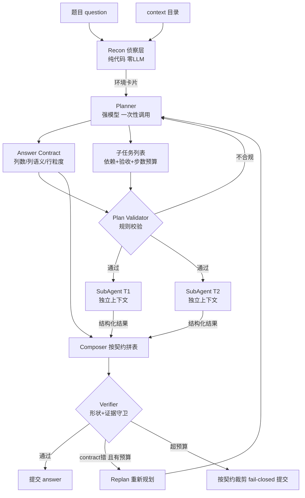

# 自研 Agent 架构设计（Plan-and-Execute + 子 Agent 隔离）

> **是什么**：Penn 自研 `penn_data_agent` 的架构说明——用「先规划后执行 + 子 Agent 信息隔离」替代官方 ReAct。
> **为什么重要**：这是 v0.3 之后的主架构，决定了后续所有优化往哪加；本地 50 题归因里最大的失分点（答案列形状）就是靠它来根治的。
> **和比赛的关联**：KDD Cup 2026 Phase 1 只打公共榜，分数 = `max(0, Recall − 0.5 × 额外列占比)`，架构必须服务于「列粒度必须准、多给列要罚分」。

---

## 1. 一句话结论

> **把官方交给模型 `thought` 的三件隐性职责——规划、校验、修正——全部显式化、工程化**：
> 侦察交给代码（零 LLM）、规划交给 Planner 并强制先定「答案契约」、执行交给彼此隔离的子 Agent、
> 提交前过一道 fail-closed 门禁；规划错了还有一次 replan 预算。

---

## 2. 为什么放弃 ReAct：它到底缺什么

官方 REACT 的拆解见 [REACT机制拆解.md](REACT机制拆解.md)，这里只列**设计缺口 → 本架构的对策**：

| 官方缺口 | 后果（实测） | 本架构对策 |
| --- | --- | --- |
| 任务拆解只在 `thought` 里发生，无 plan 对象 | 过早作答 / 中途漂移 | Recon 后由 Planner 产出**显式计划**（可落盘、可审计） |
| 前 3~5 步都在重复「看有什么文件」 | 白烧步数（16 步挂了 6 道题） | **Recon 层用代码扫描**，零 LLM、零步数 |
| 答案列粒度由最后一刻自由发挥 | 列数一致 mean 0.806 vs 多给列 0.167 | **Answer Contract 前置** + Verifier 复核 |
| 全量历史回放 | 17 步即 15K tokens；task_257 触发 413 | 子 Agent **独立上下文** + observation 截断/折叠 |
| 解析失败也占一步 | 连续 `__error__` 烧光预算 | 严格 schema 校验 + **错误回灌重试不计步** |
| 无阶段门控 | 答错也算"完成" | Verifier 门禁 + replan 预算 |

---

## 3. 架构总览



**信息流的关键约束**：子 Agent 之间**不共享对话历史**，只通过 `WorkerResult`（findings / artifacts / evidence）传递。主上下文因此不会因为某个子任务的探索噪声而膨胀。

---

## 4. 五个关键机制

### 4.1 Recon：把探索从 LLM 手里拿走

`recon.py` 用确定性代码扫描 context，产出「环境卡片」：

| 资产类型 | 抽取内容 | 体积控制 |
| --- | --- | --- |
| CSV | 表头 + 前 3 行 + 行数 | 超 50MB 不精确统计行数（提示用 SQL/Python 聚合） |
| SQLite | 表名 + 列名 + 行数估计（`MAX(rowid)`） | 只取 `sqlite_master` |
| JSON | 结构骨架（顶层 key / 首元素结构） | 只读前 200KB |
| 文档 | 开头片段 | **`knowledge.md` 优先给足 3000 字符**（每题自带的领域说明） |

> 这一步是「先看后规」的落地：Planner 是**看着事实规划**，不是盲猜。

### 4.2 Answer Contract：把列粒度提前定死

50 题归因的结论（见 [../baseline/全量跑分复盘.md](../baseline/全量跑分复盘.md) §4）：
**列数一致 mean 0.806（perfect 29/36），多给列 0.167，少给列 0.056。**

所以契约在规划阶段就强制输出：

```
expected_columns: [{name, semantic, dtype}]   # 每个"量"单独一列，禁止合成 "1-1"
row_grain: 一行代表什么
expected_row_count: int | null
```

并在 `planner.md` 里写死三条铁律：**每个量一列**、**不输出题目没要求的辅助列**、**大文件必须聚合**。
典型反例（task_330）：主客队比分必须两列，合成 `final_score="1-1"` 直接归零。

### 4.3 SubAgent：一个子任务一个独立上下文

- 输入只有：原题 + 契约 + **本**子任务 + 前置子任务的结构化结果 + 环境卡片；
- 工具集 = 官方 8 工具 **− `answer`（子 Agent 无权直接提交答案） + `finish`**；
- 输出：`{"status", "findings", "artifacts", "evidence", "notes"}`，其中 `artifacts` 要求给可直接入表的数值/列表；
- 上下文治理：单条 observation 截断到 3000 字符，超过最近 3 步的历史 observation 折叠成一行。

### 4.4 Verifier：fail-closed 门禁

| 问题类型 | 判定 | 处置 |
| --- | --- | --- |
| `contract` | 契约与原题冲突（列数/粒度错） | `replan` |
| `shape` | 列数/行宽不符 | 给修正表 → `submit` |
| `evidence` | 值在子任务结果中找不到支撑 | **删列**（宁缺勿滥）→ `submit` |
| `semantic` | 列语义不对（给了 ID 而题目要内容） | `replan` |
| `format` | 空表/类型错 | `retry` |

规则前置：空表直接判不过，不必花钱问模型。

### 4.5 协议：文本 JSON + 严格 schema + 重试

选择文本 JSON（而非 Function Calling）的理由：**模型兼容性最好**，任何 OpenAI 兼容后端都能跑；
代价由 `jsonio.py` 自己扛：

- 抽取：`raw_decode` 扫描全部 `{` 起点，兼容围栏 / 前后废话 / 多个对象；
- 校验：轻量 schema（type / required / items / enum / min_len / nullable）；
- 重试：把**具体错误**回灌给模型（"缺少字段 subtasks"），且**重试不计工具步数**（官方最大的预算黑洞）。

---

## 5. 代码地图

| 文件 | 职责 |
| --- | --- |
| `config.py` | 配置（模型/预算/上下文治理），极简 yaml 解析，可直接复用官方 `configs/*.yaml` |
| `llm.py` | OpenAI 兼容客户端；`complete_json()` = 抽取+校验+错误回灌重试；`ScriptedLLM` 测试替身 |
| `jsonio.py` | 文本 JSON 抽取与 schema 校验 |
| `dataset.py` | 任务加载 / gold 读取 / prediction 落盘 |
| `recon.py` | 环境卡片（确定性扫描） |
| `planner.py` | 计划生成 + **规则校验**（子任务数、id 唯一、依赖无环、工具名合法） |
| `worker.py` | SubAgent：独立上下文 ReAct + `finish` 结构化回传 |
| `composer.py` | 按契约拼表（rows 规整成矩形） |
| `verifier.py` | fail-closed 门禁 |
| `orchestrator.py` | 主编排：Recon→Plan→Execute→Compose→Verify→Replan |
| `agent.py` | **ReAct 对照基线**（同协议、同模型，用于对照实验） |
| `runner.py` | 批量跑分 + 调 `evaluation/scoring.py` 出分 |
| `scripts/analyze_run.py` | 跑分报告分析（列形状分布 / 按难度 / 失败归因） |

---

## 6. 实测（2026-09-07，qwen3.6-flash 统一模型）

| 场景 | 结果 |
| --- | --- |
| 离线冒烟（ScriptedLLM，不调模型） | 7 个用例全过（协议校验 / 计划校验 / 环检测 / Recon / 全链路） |
| task_11（easy，单题） | score 1.0，与 gold 完全一致 |
| 小批量 5 题（task_11/19/22/24/25） | 5/5 提交，4 题满分；task_25 列形状对但值错 |
| **全量 50 题（plan-execute）** | **提交 48/50，overall 0.5417 / perfect 27**；task_80、task_173 因 API 网络超时未提交 |

### 6.1 全量列形状分布（核心目标验证）

| 形状 | 数量 | 说明 |
| --- | --- | --- |
| 列数一致 match | **42/48** | Answer Contract 前置 + Verifier 形状守卫生效 |
| 多给列 extra | 4 | 仅 4 题，罚分远低于官方基线的"多给列"面 |
| 少给列 missing | 2 | 仅 2 题 |
| 未提交 no_pred | 2 | 均为 API 网络超时（非架构问题） |

> 与官方 baseline 归因对照：官方"已提交题中列数一致 mean 0.806 / 多给列 0.167 / 少给列 0.056"。
> **本架构把"多给列 / 少给列"压到极低（extra 4 + missing 2），列粒度守卫目标达成**；
> 但"列数一致却 recall=0（值算错）"有 20 题，是下一阶段主战场。

### 6.2 与官方 ReAct 基线（同 qwen3.6-flash）对照

| 指标 | 官方 ReAct（09-06） | 自研 P-a-E v0.3（09-07） | 差 |
| --- | --- | --- | --- |
| overall | 0.5967 | 0.5417 | -0.055 |
| perfect | 29/50 | 27/50 | -2 |
| 未提交 | 7 | 2 | **-5（改善）** |
| 多给/少给列 | 较多 | 极少（6） | **改善** |
| 列对但值错 | 11 | 20 | 恶化（待优化） |

> 结论：**架构的"形状守卫"价值已验证（列形状错误几乎归零），但"执行质量"（子 Agent 算对值）首版偏弱**，
> 这是 v0.3→v0.4 的优化主线（见 §7 与 `00-progress.md`）。官方 prompt 经大量调优，自研首版差距合理，非架构方向错误。

### 6.3 按难度（自研 v0.3，zero = score≤0 题数，含值错全错 + 未提交）

| 难度 | n | mean | perfect | zero |
| --- | --- | --- | --- | --- |
| easy | 15 | 0.606 | 9 | 5 |
| medium | 23 | 0.565 | 13 | 10 |
| hard | 11 | 0.455 | 5 | 6 |
| extreme | 1 | 0.000 | 0 | 1 |

---

## 7. 实测后的思考与下一步

1. **列形状守卫目标已达成**：全量 48 题提交中 42 题列数一致、仅 4 多给 + 2 少给，远低于官方基线的"多给列 0.167 / 少给列 0.056"惩罚面。Answer Contract 前置 + Verifier 形状复核有效。
2. **主战场转移到"执行质量"**：全量有 20 题"列对但 recall=0"（值算错），比官方基线（11 题全错）更多。这是 v0.3→v0.4 的核心优化方向：子 Agent 的计算正确性（步数预算、工具使用、prompt 引导），而非形状。
3. **子任务粒度基本合理**：match 占比高说明 Planner 切分与契约没跑偏；但 `worker_max_steps=8` / `worker_total_steps=36` 对 medium/hard 的复杂聚合可能偏紧，导致子 Agent 中途 `finish` 返回不完整结果——需看 trace 验证（下一步诊断）。
4. **Verifier 没有"拒绝提交"权是对的**：不提交必 0 分，宁可交裁剪后的答案；本次未提交仅 2 题且都是 API 超时（非架构）。
5. **单题超时未生效（已知 bug）**：`task_timeout_seconds=1800` 在 `run_one` 未落地，导致最后 2 题卡到 API 超时而非受控失败；下次跑分前修复（用线程 + `future.result(timeout)` 兜底，至少不让整批挂起）。
6. **环境卡片长度**：60 文件上限 + knowledge 3000 字符，全量未见明显截断（`trace.env_card_chars` 可查）；extreme 题文件更多，仍需关注。
