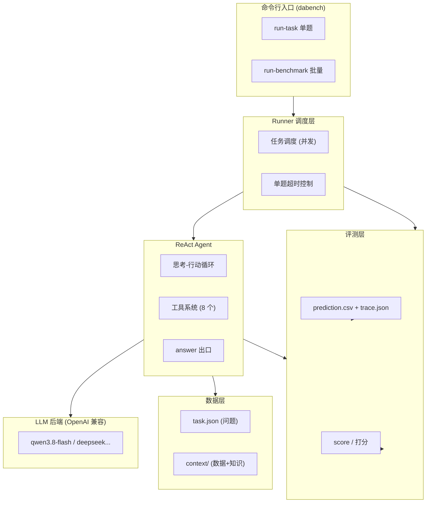
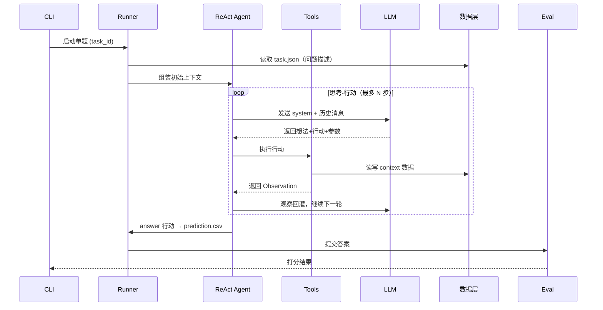
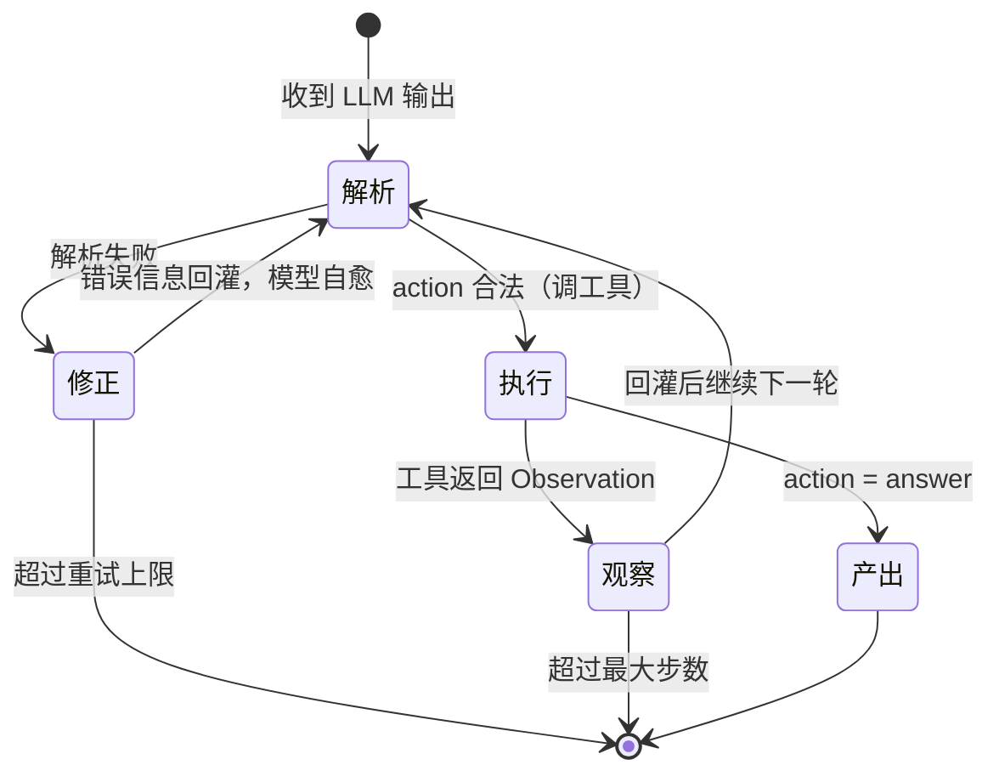

# baseline 架构总览（从架构层看懂官方 starter kit）

> **是什么**：用三张图讲清官方 baseline 怎么组织、数据怎么流、执行怎么跑。
> **为什么重要**：不看代码就能建立整体心智模型，后面看细节才不迷路。
> **和比赛的关联**：理解了它，才知道官方为什么得分 ≈0.376，自研要往哪改。

---

## 1. 一句话结论

**官方 baseline = 一个"零第三方框架"的 ReAct agent**：LLM 负责思考与决策，
8 个工具负责读写数据，`answer` 是唯一产出答案的出口，评测器把答案对到标准答案打分。
它简单、透明、可理解，但也有很多可优化空间（这正是自研的起点）。

---

## 2. 整体架构（组件图）

<!-- mermaid: 官方 baseline 的组件与边界 -->

**说明**：
- **CLI**：两条命令，一条跑一题、一条跑一整批；
- **Runner**：负责并发调度与超时强杀（单题崩溃不拖垮整批）；
- **Agent**：真正的"大脑"，思考与行动交替往复；
- **数据层**：问题（`task.json`）+ 数据包（`context/`），agent 通过工具读写；
- **评测层**：把 `prediction.csv` 与标准答案比对打分，独立于 agent。

---

## 3. 数据流（一张任务怎么变成答案）

<!-- mermaid: 单题从输入到输出的数据流向 -->

**关键**：整条链路里**只有 answer 会写最终答案**；其余所有工具都是为了拿到"回答问题所需的信息"。

---

## 4. 控制流（agent 内部的思考-行动循环）

<!-- mermaid: ReAct 主循环状态机 -->

**说明**：
- 循环的燃料是"观察→回灌→再思考"；每个 Observation 都会追加进消息历史（理解见 `basics/02`）；
- 解析失败不致命——把错误回灌给模型，让它自己改（实测 4 次解析错误全部自愈）；
- 两个"刹车"：最大步数、单题超时；
- `answer` 一出现即终止，产出最终 CSV。

---

## 5. 三个容易忽略的设计点

1. **"预览哲学"**：`read_*` 工具默认只读前若干行，让模型"先看结构再决定"，避免一上来读爆上下文；
2. **多路终止**：既有"模型主动 answer"，也有"Runner 超时兜底失败"——超时那次我们实测过（见 experiments-log）；
3. **评测独立于 agent**：agent 只负责产出预测文件，打分是另一步骤，天然可替换模型/工具。

---

> 下一步：想动手跑就看 [ops.md](ops.md)；想深入 agent 内部就看 [deep-dive.md](deep-dive.md)。
