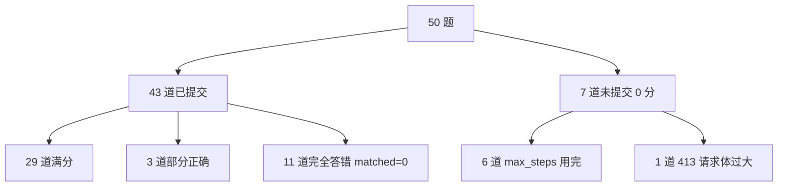

# 全量跑分复盘（50 题首个基线）

> **是什么**：2026-09-06 第一次全量 50 题跑分的完整结果、分层归因与结论。
> **为什么重要**：这是我们自己环境里**第一个可对比的基线数字**，后续所有优化都以它为参照。
> **和比赛的关联**：G2「摸清基线」达成；更重要的是它暴露了——**瓶颈不在步数，而在答案的"列形状"**。

---

## 1. 一句话结论

- 基线：**overall mean 0.5967**（含 7 道未提交按 0 分）／**submitted mean 0.6938**／**perfect 29/50**。
- 分数偏高**主要来自模型换代**（qwen3.6-flash，2026 年新模型 + 带 reasoning），架构侧**零改动**。
- 但别被均分骗了：43 道已提交题里有 **11 道（26%）完全没答对**，且**答案列数与 gold 是否一致，几乎决定了对错**（列数一致 mean 0.806，多/少给列 mean ≤0.167）。

---

## 2. 跑分结果（run: `20260906T151516Z`）

命令：`run-benchmark --config configs/qwen36_flash.yaml`（全量 50 题，`max_workers: 4`）
耗时 10 分 52 秒（4.6 task/min）。

| 指标 | 值 |
| --- | --- |
| 提交题数 | 43 / 50 |
| **overall mean**（未提交按 0 分） | **0.5967** |
| submitted mean（仅已提交） | 0.6938 |
| perfect（满分题） | 29 / 50 |
| λ | 0.5（本地复现口径） |

分层：

| 难度 | n | mean | perfect | zero |
| --- | --- | --- | --- | --- |
| easy | 15 | 0.650 | 9 | 1 |
| medium | 23 | 0.652 | 15 | 3 |
| hard | 11 | 0.462 | 5 | 2 |
| extreme | 1 | 0.000 | 0 | 1 |

> ⚠️ 注意：`zero` 只统计"没产出 prediction.csv"；**实际得 0 分的题远多于 7 道**（见 §3.2）。
> easy 与 medium 几乎持平（0.650 vs 0.652）不合常理——easy 错的全是低级错，见 §3.2。

---

## 3. 失败归因（50 题的去向）

<!-- mermaid: 50 题结果分流 -->

### 3.1 未提交 7 道：6 道是步数耗尽

| task | 难度 | 步数 | 错误步 | 原因 |
| --- | --- | --- | --- | --- |
| task_19 | easy | 16 | 6 | 步数用完 |
| task_199 | medium | 16 | 8 | 步数用完 |
| task_261 | medium | 16 | 9 | 步数用完 |
| task_344 | hard | 16 | 10 | 步数用完 |
| task_396 | hard | 16 | 3 | 步数用完 |
| task_418 | extreme | 16 | 10 | 步数用完 |
| task_257 | medium | 0 | 0 | **413 Request body too large** |

> **教训（重要）**：这次跑的 `max_steps` 是 **16**（官方默认值），不是配置模板里的 40。
> 16 步直接导致 6 道题"想做但没做完"，其中错步数高达 8~10 的题（task_344/418）
> 说明模型在反复试错——**给它更多步，大概率能救回来**。
> 另外：`max_steps` 调低是本次最大的"人为丢分项"，下次跑分前务必确认是 40。

### 3.2 提交但全错 11 道（真正的失分大头）

`matched=0`，占已提交题的 26%。抽查归因：

| task | 难度 | gold | 我们给的 | 归因 |
| --- | --- | --- | --- | --- |
| task_330 | hard | 两列 `home_team_goal=1, away_team_goal=1` | 一列 `final_score="1-1"` | **答案其实对，列粒度错了**（合并成一列） |
| task_80 | easy | 两行 `number=3, number=5` | 一行 `3` | **漏行**（两名车手只答了一个） |
| task_89 | easy | `+16.445` | `+14.925` | 名次理解错 |
| task_163 | medium | `Meeting,175.39` | `Food,121.14` | 筛错事件 |
| task_169 | medium | `459.96` | `82027220.30` | 聚合口径错（差 18 万倍） |
| task_180 | medium | 只要 `Consumption` | 给了 `CustomerID + Consumption` | **多给列** + 筛选错 |
| task_196 | medium | `1.0` | `0.0` | SQL join 逻辑错 |
| task_25 | easy | 3 个 event_name | `February Speaker` + total_cost | 答错 + **多给列** |
| task_259 | medium | 长文本 `Text` | `comment_id=90813` | 答成 id 而非内容 |
| task_379 | hard | `element` 两行 | `element + count` 两列 | 题意理解错 + **多给列** |
| task_420 | hard | `100.0` | `99.9489` | 分母口径错 |

### 3.3 部分正确 3 道

| task | score | 情况 |
| --- | --- | --- |
| task_27 | 0.083 | recall 0.33，少给 + 多给 |
| task_355 | 0.083 | recall 0.33，少给 + 多给 |
| task_38 | 0.667 | recall 1.0 但多给 2 列，被 λ 罚掉 |

---

## 4. 最强信号：列数一致性几乎决定对错

对**已提交**的 43 道题按"列数是否与 gold 一致"分组：

| 分组 | n | mean | perfect |
| --- | --- | --- | --- |
| **列数一致** | 36 | **0.806** | **29** |
| 多给列 | 4 | 0.167 | 0 |
| 少给列 | 3 | 0.056 | 0 |

按 gold 列数看难度：

| gold 列数 | n | mean | perfect |
| --- | --- | --- | --- |
| 1 列 | 36 | 0.741 | 26 |
| 2 列 | 4 | 0.500 | 2 |
| ≥3 列 | 3 | 0.389 | 1 |

**结论**：
1. **列数对 → 几乎必对**（36 道里 29 道满分）；列数错 → 几乎必 0 分。
2. 这把 `00-progress.md` 里"**减少 Extra Columns 罚分是性价比最高的改动**"从推测升级为**数据支撑的结论**。
3. 含义：答案的**列粒度**要按问题语义拆开（如 task_330 主客队比分必须两列，不能合成 `1-1`），
   这是自研 v0.2「输出守卫 + 形状校验」的**第一优先级**。

---

## 5. 为什么分数看起来"不像 baseline"？

对比：官方裸 baseline 复盘值 micro ≈ **0.376**、perfect 率约 16%；我们 overall **0.5967**、perfect **58%**。

**主因是模型，不是架构。** 证据链：

1. **架构零改动**：用的就是官方原版 ReAct 代码，本次只加了 `--difficulty`（不影响算法）；
2. **步数也没占便宜**：`max_steps=16` 就是官方默认值；
3. 那差距只能来自模型 —— `qwen3.6-flash` 是 2026 年新版（带 reasoning tokens 的思考型模型），
   远强于 0.376 那个复盘中使用的后端；
4. perfect 率 58% vs 16%，是**量级差异**，符合"模型换代"而非"调参优化"。

**但绝不能因此认为"达到冠军水平"**：

| 对照 | 数字 | 说明 |
| --- | --- | --- |
| 我们 | 0.5967 | **demo 50 题**（公开调试子集） |
| 冠军 A-board | 0.5965 | **官方评测集**，数据集不同 |
| 冠军 B-board / Final | 0.6812 / 0.6685 | hidden set |

- 数字接近纯属巧合，**跨数据集的分数不可比**；
- demo 是给参赛者调试用的公开小样本，通常比 hidden set 友好；
- 0.376 来自第三方复盘仓库，非官方发布值，本身也有不确定性。

**补充：这个分数不是"评分口径运气"。** λ 敏感性实测：

| λ | overall mean |
| --- | --- |
| 0.0 | 0.6133 |
| 0.25 | 0.6050 |
| 0.5（默认） | 0.5967 |
| 1.0 | 0.5867 |

λ 从 0 拉到 1，分数只掉 0.027 —— 说明**大部分题要么全对要么全错**，分数结构扎实，不依赖 λ 假设。

---

## 6. 下一步（按性价比）

| 优先级 | 动作 | 预期收益 |
| --- | --- | --- |
| P0 | `max_steps` 改回 **40** 重跑 | 6 道步数耗尽的题有望救回，overall 直接抬升 |
| P0 | **列形状守卫**：answer 前校验列数/列粒度与问题语义一致 | 针对"多给列/少给列"全军覆没的 7 道 |
| P1 | 处理 413：对超长 observation 做截断/摘要 | 修复 task_257，也是长文档题的通病 |
| P2 | easy 题低级错专项（task_25/80/89 都是 easy） | easy 本该接近满分，现在只有 0.650 |

---

## 7. 我的思考与疑问

1. **均分会骗人**：0.5967 看着不错，但拆开是"29 道满分 + 11 道全错 + 7 道没交"的两极分布。
   后续看分必须同时看 **perfect 数** 和 **全错数**，不能只看 mean。
2. **列粒度是个隐藏陷阱**：task_330 模型其实答对了（1-1），只因合成一列就归零。
   这类"对但不合规"的损失，属于纯工程可修复项，比提升推理能力便宜得多。
3. **easy 比 hard 更该反思**：easy 错的是"最低成本事件""车手编号"这类简单题，
   不是能力问题是**稳定性问题**（同一题多次跑结果不同）。是否需要多次采样投票？
4. 待验证：把 `max_steps` 提到 40 后，分数能涨多少？会不会因为步数变多反而多给列、被罚分？
