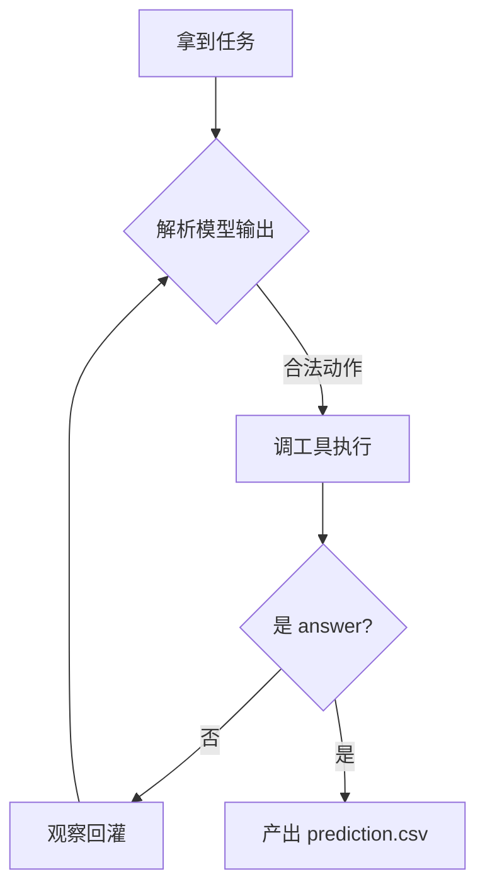

# doc_agent.md — Penn 文档写作规范（AI 整理文档的要求）

> 适用范围：`learning/PENN/` 下所有文档（baseline / agent / basics）。
> 目的：让文档**对人类易读、负担小**，同时保持结构化以便 AI 后续增补。
> 约束：AI 在整理、重写、新增本目录文档时，必须遵守本规范。

---

## 1. 总原则：从读者出发，尽量减轻负担

1. **先结论后细节**：每篇文档开篇给"一句话结论 / 这篇讲什么 / 为什么重要 / 与比赛的关系"。
2. **能图不字**：架构、数据流、控制流优先用 **Mermaid 图**（流程图 / 时序图 / 架构图），少堆文字。
3. **能分层不深入**：先讲架构层 / 数据流 / 控制流；只有架构层讲不清楚的，才开独立文件做细节深挖。
4. **从上到下**：细节说明严格"自上而下"（顶层结构 → 逐层下沉 → 具体代码），不要跳跃。
5. **贴心载入目录**：README 是指南针，负责告诉读者"先读哪个、为什么、去哪找细节"。

---

## 2. 三个子目录的定位（铁律：放对地方）

| 目录 | 放什么 | 不放什么 |
| --- | --- | --- |
| `baseline/` | 官方 starter kit 的学习：架构、流程、评测、运维（补丁 / 跑法） | 通用 AI 知识；我的自研方案细节 |
| `agent/` | **我的自研 agent** 项目说明、设计、路线图 | baseline 代码细节；通用知识 |
| `basics/` | **跨项目通识**：ReAct / LLM 上下文 / token / 并发等跟项目无关的知识 | 只讲官方代码的东西 |

> 判断一句话：去掉 KDD 背景它还成立吗？
> - 成立 → 放 `basics/`；不成立 → 放 `baseline/`（讲官方）或 `agent/`（讲自己）。

---

## 2A. ⭐ 总控文档 `00-progress.md`（重点标记，必维护）

> Penn 评价：**"这个文件非常好"**——它是整个 PENN 学习工作的"总控台"，所有 AI
> 协作者必须把它当**最重要的入口文档**对待。

铁律：
1. **每次有实质进展，必须及时更新 `00-progress.md`**（跑通 / 跑分 / 加功能 / 改架构 / 删目录…）。
2. 更新三件事：**时间线加一行**（日期+里程碑+产出）、**勾掉/新增待办**、**刷新"最后更新"日期**。
3. 涉及目标阶梯 / 参照基准的变动（分数、新冠军数据）也要同步。
4. 它是根 README 与各模块 README 之外的"动态真相"，静态笔记（baseline/basics/agent）与之互为补充：
   - 笔记讲"怎么理解"；`00-progress.md` 讲"现在到哪了、下一步干嘛"。
5. 其他文档交叉引用都指向这份文件，不要再建平行的"进展/日志"类目录（已废弃 experiments-log）。

---

## 3. 每篇文档的统一结构

```markdown
# NN · 简短标题

> **是什么**：一句话
> **为什么重要**：一句话
> **和比赛的关联**：一句话

## 1. 核心概念 / 一句话结论
## 2. 关键机制（优先 Mermaid）
## 3. 在官方 baseline 中的体现（文件:行号，点到为止）
## 4. 我的思考与疑问
```

---

## 4. Mermaid 使用规范

- 架构/组件关系 → `flowchart`（带分组 `subgraph`）；
- 数据流 → `sequenceDiagram`（消息往返）；
- 控制流/状态 → `stateDiagram-v2` 或 `flowchart`（判断分支）；
- 每张图前一行加 `<!-- mermaid -->` 注释和一句图说明；
- 图内节点用中文短词，图下方用列表补足文字说明。

```markdown
<!-- mermaid: ReAct 主循环 一层图 -->

```

---

## 5. 命名与编号

- **内容文档用中文短名**，贴主题即可（如 `架构总览.md`、`函数调用.md`），不写死英文 kebab-case。
- `basics/` 下内容文档保留 `NN-` 数字前缀表推荐阅读顺序（如 `03-采样与参数.md`），数字序号不变。
- **约定功能名保持英文不翻译**：各目录 `README.md`（索引）、总控 `00-progress.md`、规范 `doc_agent.md`。
- 目录内 `README.md` 为索引，用表格列出：编号 / 主题 / 文件 / 状态。

---

## 7. 维护纪律

1. **有实质进展先更新 `00-progress.md`**（见 §2A），再更新相关笔记。
2. 改动文档时**同步更新**相关 README 索引与"状态"列。
3. 删文件用 `git rm`，并同步清理其它文档里指向它的交叉引用。
4. 交叉引用必须指向**最终落位的相对路径**，改动结构后逐一核对引用是否失效。
5. 文档里禁止出现真实密钥片段（见根目录 `AGENTS.md` §3）。
