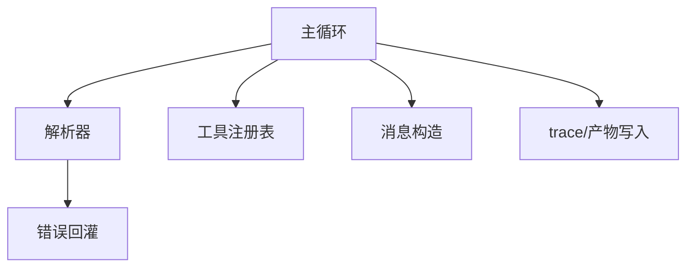

# REACT 机制拆解：官方 agent 是怎么想的

> **是什么**：把官方 ReAct agent 拆成"代码架构 + 设计取舍 + 任务是怎么被隐性拆解的"三块。
> **为什么重要**：自研不是推翻它，而是知道它**为什么这么写**，才知道该改哪。
> **和比赛的关联**：本赛的评分对"列形状"和"步数效率"极敏感，机制理解直接决定改法。

> ⏳ **待补写**：读完 `baseline/细节深挖.md` 后填。文末要把结论映射到自己的 v0.x 计划。

## 1. 代码架构（待填）

- [ ] 类/模块分层：谁负责调度、谁负责解析、谁负责工具分发
- [ ] 状态放在哪：messages、step 计数、中间产物分别由谁持有

<!-- mermaid: 官方 agent 组件关系占位 -->

## 2. 设计取舍（待填）

| 取舍点 | 官方选择 | 代价 | 我的替代方案 |
| --- | --- | --- | --- |
| 输出格式 | （自由文本 JSON？FC？） | | |
| 观察回灌 | （全量？截断？） | | |
| 步数与终止 | | | |
| 工具可见性 | （一次全给？） | | |

## 3. "任务是怎么被隐性拆解的"（待填）

- [ ] 官方有没有显式规划？还是靠 prompt 让模型在 thought 里隐式规划？
- [ ] 隐式拆解失败的典型表现（跑偏 / 重复劳动 / 步数耗尽）
- [ ] 显式 PLAN 阶段能补上什么

## 4. 映射到我的自研版本

| 版本 | 改动点 | 预期收益 | 验证方式 |
| --- | --- | --- | --- |
| v0.1 | 最小 ReAct loop（含 FC 化输出） | 消灭解析类故障 | 同题集对比 |
| v0.2 | 输出守卫 + 观察截断 | 降罚分、控上下文 | 同上 |
| v0.3 | 显式规划 + 阶段门控 | 减少跑偏 | 同上 |

---

> 版本目标与分数对照写在 [../00-progress.md](../00-progress.md)。
