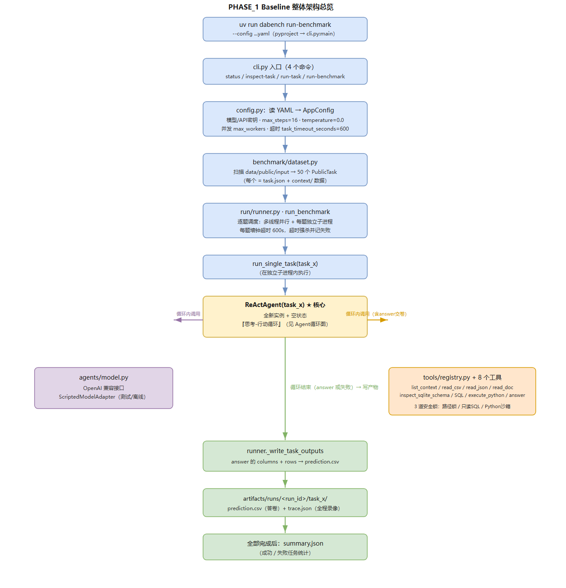
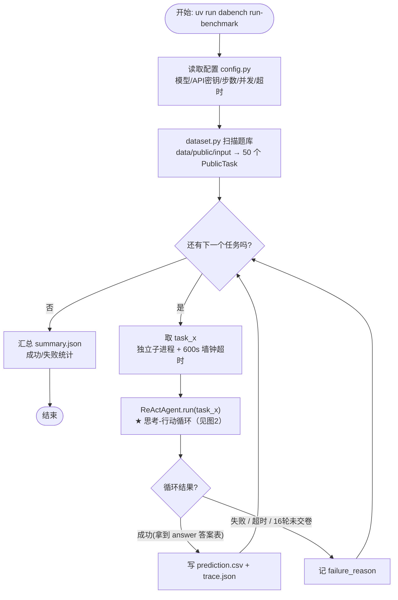
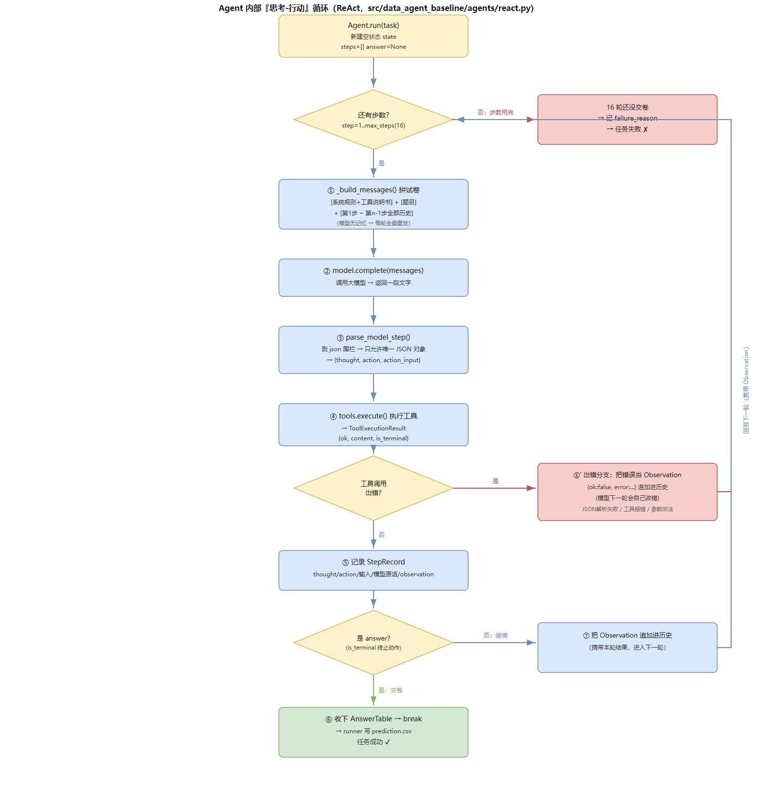

# KDD Cup 2026 DataAgent-Bench · Phase 1 Baseline 架构总览

> 阅读对象：零基础读者
> 一句话：官方给了 50 道"数据题"，baseline 是一个让 AI 自己动手解题的最小框架。
> 阅读时间：约 10 分钟。
> 文中两张架构图均有**图片版**（存放在 `images/` 目录：png + 可编辑的 svg），本文同时也附了可折叠的 Mermaid 源码。

---

## 0. 太长不看（TL;DR）

- 每道题 = **一个数据文件夹 + 一句自然语言问题**，AI 要自己分析并交一张**答案表**。
- baseline = 让**大模型当大脑**、让 **Python 程序当手脚** 的框架。
- 大脑只会"说话"：每次只返回一条 JSON 指令；手脚负责真的去读文件、跑代码、查数据库。
- 解题方式是 **ReAct 循环**：想一步 → 做一步 → 看结果 → 再想……最多 16 轮。
- 最终必须调用 `answer` 工具交卷；50 道题**互相独立**地逐个跑。

---

## 1. 先搞懂 6 个小概念（不懂后面会卡壳）

| 概念 | 一句话解释 | 在本项目里是谁 |
|---|---|---|
| **大模型(LLM)** | 会"接话"的 AI，例如 ChatGPT 背后的技术 | Agent 的"大脑" |
| **API** | 程序调用大模型的"电话线" | `agents/model.py` |
| **Agent(智能体)** | 能自己决定"调用哪个工具、下一步做什么"的程序 | `ReActAgent` |
| **工具(Tool)** | 给 Agent 使用的"手脚"（读文件/跑代码/查库/交卷） | `tools/` 下的 8 个工具 |
| **ReAct** | "想-Reason → 做-Act → 看结果" 的循环工作法 | `agents/react.py` 的主循环 |
| **context(上下文)** | 每道题专属的数据文件夹，Agent 只能看这里 | 每题的 `task_x/context/` |

**最重要的一个观念：模型不碰文件。** 它看到的一切都是"文字"（文件预览、工具结果）；它做出的每个决定都要翻译成 JSON 文字；真正动手的是外面的 Python 程序。

---

## 2. Phase 1 在干嘛：赛题长什么样

### 2.1 一道题的结构（磁盘上）

```text
data/public/input/task_11/
├── task.json          # 题面：{task_id, difficulty, question}
└── context/           # 答题素材（AI 唯一能看的资料柜）
    ├── knowledge.md   # 字段说明书（每个表/每个字段什么意思）
    ├── json/…         # 数据本体（也可能是 csv/、db/、doc/）
    └── …
```

`task.json` 里的问题举例（真实数据）：

> *"For patients with severe degree of thrombosis, list their ID, sex and disease the patient is diagnosed with."*
> （找出严重血栓的病人，列出他们的 ID、性别、所患疾病。）

标准答案是一张表（存在 `output/task_11/gold.csv`）：列 = ID / SEX / Diagnosis，行 = 3 个病人的记录。
**AI 的目标就是：通过看数据、做分析，最后交出一张和标准答案内容一致的表格（`prediction.csv`）。**

> 判分方式（不用记细节）：官方按"每一列的内容"匹配——列名、行顺序都不重要，重要的是**该有的列全算对、数值准确、别多给噪音列**。

### 2.2 Agent 是怎么"解题"的（人话版）

对一道题，Agent 大致按下面的过程走（这就是后面"内部循环图"的通俗版）：

1. **读题**：知道要回答什么问题；
2. **侦查**：用 `list_context` 看看资料柜里有什么文件；
3. **查资料**：用 `read_doc` 读说明书、`read_csv/read_json` 看数据、`inspect_sqlite_schema` 看库表结构；
4. **计算**：需要算数时用 `execute_python` 写 Python 代码（或对数据库用 `execute_context_sql` 写只读 SQL）；
5. **整理答案**：把结果整理成 `columns + rows` 的表格；
6. **交卷**：调用 `answer` 工具提交表格 → 任务结束。

### 2.3 50 道题是怎么跑的

- 一次运行 = **把 50 道题逐个、独立地跑一遍**；
- 每道题：**新建一个干净的 Agent + 全新空状态**，题与题之间**不共享任何记忆**；
- 每道题跑在**独立子进程**里，受 **600 秒**墙钟超时保护（跑不完就杀掉并记失败）；
- 单题内部最多 **16 轮**思考-行动，16 轮没交卷也判失败；
- 每题产出两份文件：`prediction.csv`（答卷）和 `trace.json`（全过程"录像"），全部跑完再汇总一份 `summary.json`。

---

## 3. 整体架构图（图片版）

<p align="center">
  
</p>

> **这张图怎么读**：主线从"命令行"开始 → 读取配置 → 扫描出 50 道题 → 进入**菱形判断「还有下一个任务吗?」**（这就是 50 题逐题循环）。每道题在黄色 **ReActAgent** 框里完成解题（详见第 4 节图 2），成功 → 写 `prediction.csv + trace.json`；失败/超时/未交卷 → 记 `failure_reason`；两条支路都会**回到循环**处理下一题。50 题全部跑完 → 写 `summary.json` → 结束。

<details>
<summary>📐 想自己编辑这张图？展开查看 Mermaid 源码</summary>


</details>

### 图 1 解释（跟着箭头看一遍）

| 图中内容 | 它在干嘛 | 对应代码 |
|---|---|---|
| (开始) 命令行 | 敲一条命令启动整个流程 | `pyproject.toml` → `cli.py` |
| 读取配置 | 把"用什么模型、最多几步、几秒超时"读进来 | `config.py` |
| 扫描题库 | 把磁盘上的 50 个任务目录变成内存里的任务对象 | `benchmark/dataset.py` |
| ◇ 还有下一个任务吗 | **核心循环**：50 题逐题处理，处理完一题回到这里 | `run/runner.py` |
| 独立子进程+超时 | 每题单独隔离执行，防止一题崩溃影响全部 | `runner.py`（multiprocessing） |
| ★ 思考-行动循环 | 单题内部真正的"解题大脑"，放大见图 2 | `agents/react.py` |
| ◇ 循环结果 | 成功→写答卷；失败→记录原因；两种都会回到"下一题" | `agents/runtime.py` |
| 写 prediction.csv | 把答案表落盘 = 你交给比赛的成绩单 | `runner.py` |
| (结束) summary | 全部题目跑完后的汇总报告 | `runner.py` |

---

## 4. Agent 内部"思考-行动"循环图（ReAct）

<p align="center">
  
</p>

> **这张图怎么读**：对**一道题**的完整生命周期。左侧主线是"成功路径"（拼试卷 → 问模型 → 拆 JSON → 执行工具 → 记录 → 是 `answer`? → 交卷成功）；中间 `answer?` 判断"否"会带着观察回到顶部**继续下一轮**（最多 16 轮）；右上红色块是"出错分支"——模型 JSON 写错或工具报错时，把错误当作观察回灌，让模型**下一轮自己纠错**；顶部菱形"还有步数?"为"否"（16 轮没交卷）即任务失败。

<details>
<summary>📐 想自己编辑这张图？展开查看 Mermaid 源码</summary>

```mermaid
flowchart TD
    S([开始: Agent.run(task)<br/>新建空状态]) --> D1{"还有步数?<br/>step ≤ max_steps(16)"}
    D1 -- 否 --> F([任务失败<br/>记 failure_reason])
    D1 -- 是 --> B1["① 拼试卷 _build_messages<br/>规则+8个工具说明书+题目<br/>+ 第1步到现在的全部历史"]
    B1 --> B2["② model.complete(messages)<br/>把对话发给大模型"]
    B2 --> B3["③ parse_model_step 拆 JSON<br/>→ thought / action / action_input"]
    B3 --> B4["④ tools.execute 执行工具<br/>读文件 / 查库 / 跑Python"]
    B4 --> B5["⑤ 记录 StepRecord<br/>存进 trace 历史"]
    B5 --> D2{"是 answer 工具?<br/>(终止动作)"}
    D2 -- 否 --> OBS["⑥ 把 Observation 追加进历史<br/>携带本轮结果继续"] --> D1
    D2 -- 是 --> OK([成功: 收下 AnswerTable<br/>break → 写 prediction.csv])
    B3 -->|出错| ERR["错误当 Observation 回灌<br/>(模型下一轮自己纠错)"] --> D1
    B4 -->|出错| ERR
```
</details>

### 图 2 解释：每一格在干嘛（重点，建议逐行对照源码读）

| 步骤 | 在干嘛（人话） | 输入 → 输出 | 关键代码 |
|---|---|---|---|
| (开始) | 为这一题新建"空记忆本" | 无 → `AgentRuntimeState` | `react.py: run()` |
| ◇ 还有步数? | 最多跑 16 轮，防止模型无限"想下去" | 轮数 → 是/否 | `react.py` 的 for 循环 |
| ① 拼试卷 | 模型没有记忆，所以**每轮把历史完整重发**；并把工具说明书拼进去让模型"知道有这些工具可用" | `PublicTask` → `messages` | `prompt.py` |
| ② 调大模型 | 把对话文字发给 OpenAI 兼容 API | `messages` → 一段文字 | `model.py` |
| ③ 拆 JSON | 模型必须只回一个 JSON（想什么/用哪个工具/参数是什么）；程序负责拆开并校验 | 文字 → `ModelStep` | `react.py: parse_model_step` |
| ④ 执行工具 | 程序真的去读文件/SQL/跑 Python；模型**看不到也碰不到**数据本身 | 指令 → 工具结果 | `tools/registry.py` 等 |
| ⑤ 记录 | 把"想了什么+做了什么+看到什么"写进历史（最终进 trace.json） | 结果 → `StepRecord` | `agents/runtime.py` |
| ◇ 是 answer? | 只有 `answer` 是"终止动作"；其它工具再成功也不算做完 | 工具名 → 是/否 | `registry.py` 的 `is_terminal` |
| ⑥ 追加观察 | 没交卷就把这轮结果装进口袋，回到 ① 进入下一轮 | Observation → 历史 | `react.py` |
| 出错分支 | 模型 JSON 写错/工具报错 → 不崩溃，把错误当"观察"喂回去，让它下轮自己改 | 异常 → 错误观察 | `react.py` 的 try/except |
| (成功/失败) | 拿到答案表 = 成功；16 轮没交 = 失败 | `AnswerTable` 或 `failure_reason` | `runtime.py` |

> **看清"谁有记忆谁没记忆"**：记忆在 Python 侧的 `AgentRuntimeState` 里；模型每一轮只拿到拼好的文字，聊完即忘。

---

## 5. 一张表记住整个项目（模块速查）

| 模块（文件） | 一句话职责 | 通俗类比 |
|---|---|---|
| `cli.py` | 命令行入口（4 个命令） | 前台接待 |
| `config.py` | 读取 YAML 配置 | 设置单 |
| `benchmark/dataset.py` | 扫描 50 题、校验题面 | 题库管理员 |
| `run/runner.py` | 逐题调度、子进程、超时、写产物 | 考场监考 |
| `agents/react.py` | ★ 思考-行动主循环 | 大脑回路 |
| `agents/prompt.py` | 拼"给模型看的试卷" | 出题人 |
| `agents/model.py` | 连接大模型（可换任意 OpenAI 兼容模型） | 大脑神经接口 |
| `agents/runtime.py` | 记录每一步（trace 的数据结构） | 监控录像 |
| `tools/` | 8 个工具 + 3 道安全锁 | 手脚 + 安全带 |
| `artifacts/runs/` | 输出：prediction.csv / trace.json / summary.json | 答卷归档 |

---

## 6. 附：图片文件与怎么修改

- **文中两张图已经是 PNG 图片**（`images/整体架构图.png`、`images/Agent思考行动循环.png`），在任何设备（GitHub 网页/手机/本地 Typora/Word）都能直接显示；
- **想改图**（推荐任选其一）：
  1. 展开本文第 3、4 节里的 "📐 Mermaid 源码" 直接改文字——GitHub 会自动渲染，本地用 Typora 或 VS Code（装 Markdown Preview Mermaid Support 插件）预览；
  2. 用 [draw.io](https://app.diagrams.net) 打开矢量版 `images/整体架构图.svg`、`images/Agent思考行动循环.svg`，图形化拖拽修改后导出 PNG；
- **想改正文**：直接编辑本文件即可。

> 更多细节：仓库根 README 与 `PHASE_1/README.zh.md`；想跑起来看 `uv run dabench status / inspect-task / run-task / run-benchmark`。

