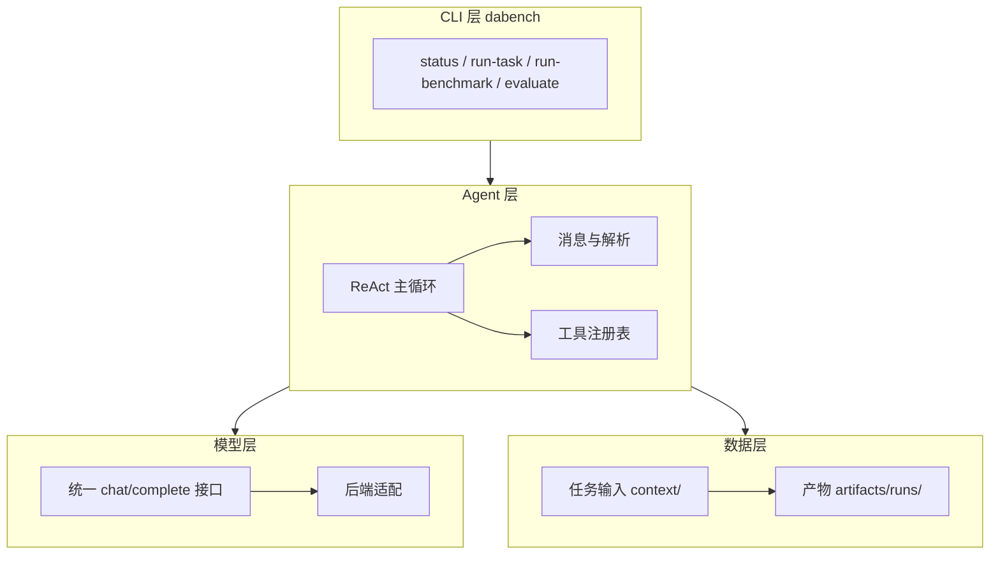
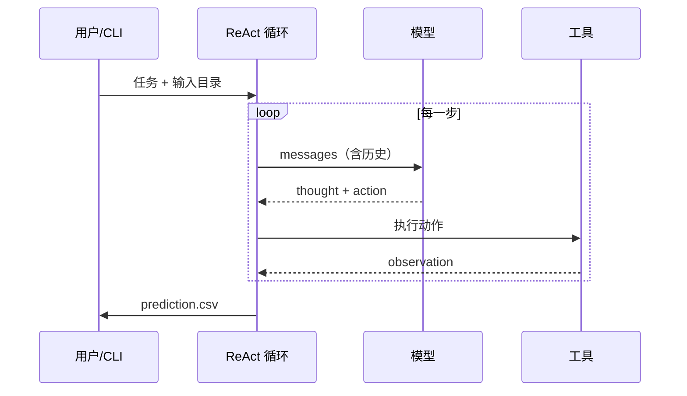

# 架构总览：官方 baseline 是怎么跑起来的

> **是什么**：官方 starter kit（Phase 1）的整体架构、数据流与控制流。
> **为什么重要**：自研之前必须先有一张"它到底怎么跑"的地图，否则改代码就是盲改。
> **和比赛的关联**：所有跑分结果都在这个架构上产生，优化点也必须落在它的某个环节上。

> ⏳ **待补写**：读源码时按下面的图骨架与清单填。图先画一层，能讲清就不下沉。

## 1. 分层架构（待填）

<!-- mermaid: 分层架构占位，读码后替换 -->

填图时要标清：每层的**入口文件**、**职责**、**依赖方向**。

## 2. 一次 run-task 的控制流（待填）

<!-- mermaid: 单题执行时序占位 -->

要标出：**循环终止条件**（answer 工具 / 步数上限）、**失败如何恢复**（解析错误回灌）、**产物写在哪**。

## 3. 需要回答的问题清单

- [ ] 入口命令与入口文件分别是谁？参数怎么传到 agent？
- [ ] 工具注册表有哪些工具？各自对应什么能力（执行代码 / 查库 / 读文件 / 提交答案…）？
- [ ] 提示词（system/user）在哪里拼装？任务描述与数据资产怎么注入？
- [ ] 步数上限、超时、重试分别在哪控制？默认值是多少？
- [ ] 产物目录结构：`artifacts/runs/<run_id>/` 下各文件是什么？
- [ ] 评测在哪一步触发，用的是官方口径还是本地实现？

## 4. 我的思考与疑问

- [ ] 这个架构里**最容易挂**的环节是哪个？
- [ ] 哪些环节是"换模型就能涨分"，哪些必须改架构？
- [ ] 如果我来重写，会先替换哪一层？

---

> 细节（主循环 / 工具 / prompt / 评测）写在 [细节深挖.md](细节深挖.md)。
