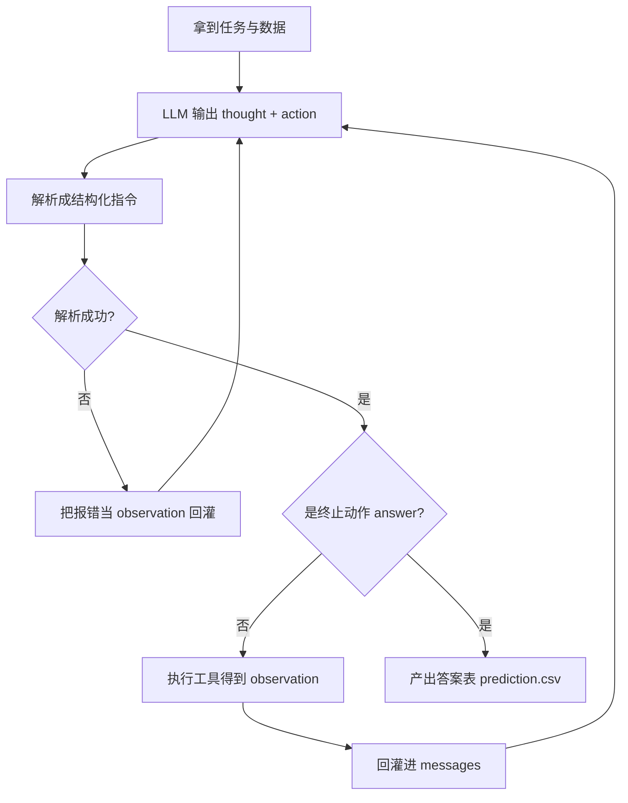

# 01 · ReAct 范式：边想边做，做完看结果再想

> **是什么**：让 LLM 交替输出「推理（Thought）」和「行动（Action）」，把环境返回的
> 「观察（Observation）」再喂回去，循环到得出答案为止。
> **为什么重要**：官方 baseline 的整个骨架就是它；吃透它，80% 的 agent 代码都能看懂。
> **和比赛的关联**：本赛的每一步 trace，本质上就是一次 Thought → Action → Observation。

## 1. 一句话结论

**推理指导行动，观察修正推理。**

<!-- mermaid: ReAct 主循环 -->


## 2. 与另外两种范式的对比

| 范式 | 形态 | 典型毛病 |
| --- | --- | --- |
| 纯推理（CoT） | Thought → Thought → … | 没有外部事实校正，容易一本正经地编 |
| 纯行动（Act） | Action → Action → … | 没有规划，盲目试错，步数浪费 |
| **ReAct** | Thought → Action → Observation → … | 上下文会随步数膨胀，需要预算管理 |

人类类比：查资料写报告——先想查什么（Thought），去查（Action），看到结果（Observation），
据此修正下一步想什么。不是一口气想完，也不是闷头乱翻。

## 3. 一次循环里必须有的四件事

```python
raw = model.complete(messages)          # ① 模型生成「想法 + 动作」
step = parse_model_step(raw)            # ② 解析成结构化指令
obs  = tools.execute(task, action, args)# ③ 工具在环境里执行，返回观察
messages.append(obs)                    # ④ 观察回灌，进入下一轮
```

| 论文里的概念 | 代码里的实体 | 说明 |
| --- | --- | --- |
| Thought | 模型输出里的 thought 字段 | 决定后面走不走弯路 |
| Action | action + action_input | 工具名 + 入参 |
| Environment | 工具注册表 | 能干什么全看这里注册了什么 |
| Observation | 工具返回值（含报错） | 回灌后模型可自愈 |
| 终止条件 | answer 类工具 / 步数上限 | 必须有兜底，否则死循环 |

## 4. 三个容易踩的坑

1. **解析失败要回灌，不要中断**：把格式错误当 observation 喂回去，模型通常下一轮就改对了；直接抛异常则整题报废。
2. **上下文线性膨胀**：每轮观察都追加进 messages，长任务 token 会失控 → 需要截断 / 摘要 / 只回灌关键结果。
3. **ReAct 是线性的，真实分析是 DAG**：并行子查询再汇合、发现错了回溯重来，原生 ReAct 都不支持——这正是自研方案的发力点。

## 5. 我的思考与疑问

- [ ] 步数上限设多少合适？太小人为丢分，太大拖慢且稀释上下文。
- [ ] 观察要不要做"结构化摘要"再回灌？摘要丢了细节怎么办。
- [ ] 如何判断某一步该回溯而不是硬着头皮往下走。

---

> 落地对照：官方 baseline 的循环实现，读源码后补到 [../baseline/细节深挖.md](../baseline/细节深挖.md)。
