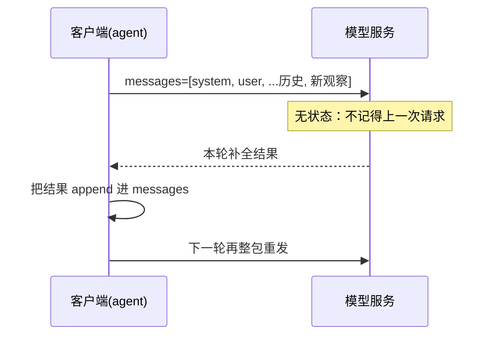

# 02 · LLM 上下文机制：为什么每轮都要把历史重发一遍

> **是什么**：大模型推理接口是**无状态**的，所谓"多轮对话"其实是客户端每轮把完整历史重发一遍。
> **为什么重要**：agent 的上下文膨胀、延迟、费用，全都由这个机制决定。
> **和比赛的关联**：ReAct 每走一步就追加一条观察，几十步下来上下文就是成本和成败本身。

## 1. 一句话结论

**模型没有记忆，记忆在客户端的 messages 数组里。**

<!-- mermaid: 无状态接口的一轮请求 -->


## 2. 关键概念

| 概念 | 说明 |
| --- | --- |
| messages 数组 | 对话的唯一真相；`system` 定规则，`user` 提需求，`assistant` 是模型历史输出 |
| 无状态 | 服务端不保留会话，换机器/重连不影响结果，代价是重复传输 |
| KV Cache | 服务端对**前缀相同**的部分复用注意力缓存，命中时重发并不等于重算（更快更便宜） |
| Token | 计费与长度的基本单位；中文与英文、代码与自然语言的分词效率差别很大 |
| 上下文窗口 | 单次请求能承载的 token 上限，超出即报错或截断 |

## 3. 由此推出的四条工程结论

1. **改前缀 = 缓存全失效**：system prompt 或早期消息一改动，后面全部重算；所以稳定不变的规则放前面，易变内容放后面。
2. **追加是廉价的，插入是昂贵的**：新观察只管 append；往中间插内容会让后面所有 token 重新计算。
3. **长上下文 ≠ 能记住**：注意力在长上下文中会稀释，关键信息应就近放置或被显式复述。
4. **截断要有策略**：先丢"最旧的工具原始输出"，保留"结论性摘要"和最近几轮；直接砍头会把任务前提弄丢。

## 4. 上下文预算的粗略心算

```text
每轮成本 ≈ system + 任务描述 + 工具说明 + Σ(历史 thought/action/observation)
总轮次 ↑  →  成本近似线性 ↑（无缓存时）
```

对策清单：
- [ ] 工具返回只回灌必要字段（不要整个 DataFrame 打印）；
- [ ] 大文本先落文件，回灌路径 + 摘要；
- [ ] 定期把早期历史压缩成一条"已知结论"消息。

## 5. 我的思考与疑问

- [ ] 我的后端是否真的吃到 KV Cache？怎么从耗时/费用上验证。
- [ ] 截断到什么粒度才不丢解题关键（尤其长文档类 hard 题）。
- [ ] 并行跑多题时，是共享一个长上下文还是每题独立（隔离性 vs 成本）。

---

> 落地对照：官方 baseline 怎么组织 messages，读源码后补到 [../baseline/细节深挖.md](../baseline/细节深挖.md)。
