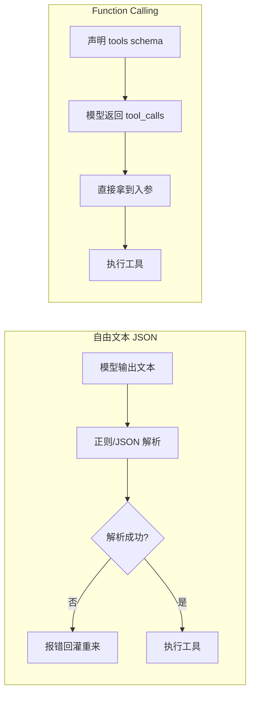

# 04 · Function Calling：把"求它按格式输出"交给服务端

> **是什么**：把工具清单以 JSON Schema 的形式告诉模型，由服务端约束/解析出结构化的调用参数。
> **为什么重要**：它能消灭"自由文本里手写 JSON"带来的一大类解析故障。
> **和比赛的关联**：官方 baseline 是自己解析模型输出里的 JSON；自研版本可以改用 Function Calling 直接绕过这个坑。

## 1. 一句话结论

**让服务端保证"结构合法"，而不是指望模型自觉。**

<!-- mermaid: 两种调用链路对比 -->


## 2. 一个工具描述的构成

```json
{
  "type": "function",
  "function": {
    "name": "run_sql",
    "description": "对 SQLite 执行只读查询，返回结果前 N 行",
    "parameters": {
      "type": "object",
      "properties": { "sql": { "type": "string" }, "limit": { "type": "integer", "default": 50 } },
      "required": ["sql"]
    }
  }
}
```

写好描述的三条经验：
1. `description` 写清**什么时候用**和**不返回什么**，比堆参数说明更有用；
2. 参数尽量少且有默认值，枚举值用 `enum` 约束；
3. 工具数量不是越多越好——同时可见 30 个工具，模型选择质量会下降（可按需分批暴露）。

## 3. 与"自由文本输出 JSON"的对比

| 维度 | 自由文本 JSON | Function Calling |
| --- | --- | --- |
| 结构合法性 | 靠解析 + 重试 | 服务端约束，可靠性高 |
| 推理过程 | 可以带 thought 字段 | 需另想办法保留 reasoning 文本 |
| 兼容性 | 任何模型都能用 | 依赖后端是否支持 |
| 调试 | 看原始文本，直观 | 看 tool_calls 对象，也直观 |

> 折中做法：让模型同时输出一段 reasoning 文本和一个 tool_call（很多后端支持"内容 + 调用"并存）。

## 4. 仍然要做的事（别以为上了 FC 就万事大吉）

- [ ] 校验入参**语义**（SQL 是否只读、路径是否越界），schema 只保证类型不保证安全；
- [ ] 限制单次调用的输出体量，避免把几千行结果灌回上下文；
- [ ] 兜底：后端不支持 FC 时降级为文本解析，两条路都要有。

## 5. 我的思考与疑问

- [ ] 我的后端支持到什么程度：并行 tool_calls、强制调用、strict 模式？
- [ ] 工具是"一次全给"还是"按阶段给"（先探索类、后作答类）？
- [ ] 如何把 ReAct 的 thought 与 FC 的调用优雅地合并到同一条消息里。

---

> 落地对照：官方解析逻辑与失败模式，读源码后补到 [../baseline/细节深挖.md](../baseline/细节深挖.md)。
