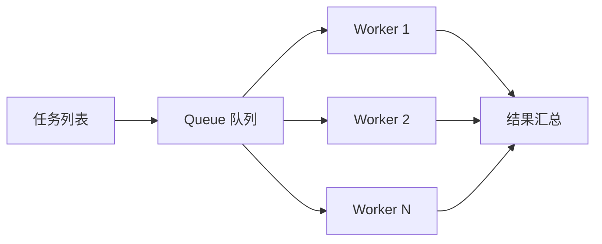

# 05 · Python 并发基础：跑 50 题时到底该开线程还是进程

> **是什么**：Python 的并发三件套（线程 / 进程 / asyncio）与它们各自的适用边界。
> **为什么重要**：批量跑题、给工具加超时、捕获子进程输出，全都绕不开它。
> **和比赛的关联**：跑全量 benchmark 的墙钟时间、以及"子进程卡死导致整轮挂掉"，都是并发问题。

## 1. 一句话结论

**I/O 密集用线程，CPU 密集用进程，千万别在子进程上忘记取走输出。**

| 方案 | 适用场景 | 关键限制 |
| --- | --- | --- |
| `threading` / `ThreadPoolExecutor` | 网络请求、文件读写、等子进程 | 受 GIL 限制，同一时刻只有一个线程执行 Python 字节码 |
| `multiprocessing` / `ProcessPoolExecutor` | CPU 密集计算（大量 pandas 运算） | 内存开销大，跨进程传对象要可序列化 |
| `asyncio` | 海量高并发 I/O（成百上千请求） | 阻塞代码会卡住整个事件循环 |

> GIL 提醒：**等 I/O 时 GIL 会释放**，所以"并发打 LLM 接口"用线程池就是合适的。

## 2. 批量跑题的典型结构

<!-- mermaid: 生产者-消费者跑批 -->


要点：
- 用 `concurrent.futures.ThreadPoolExecutor(max_workers=N)` + `as_completed` 收结果最省事；
- 并发度按**后端限流**定，不是按 CPU 核数定；
- 每个任务包一层 `try/except`，单个失败不能掀翻整批；
- 结果写入时加锁或使用线程安全队列，避免交错写坏文件。

## 3. 子进程的两个经典死锁

```python
# ❌ 死锁写法：缓冲区写满，子进程阻塞在写，父进程阻塞在等它结束
p = subprocess.Popen(cmd, stdout=subprocess.PIPE, stderr=subprocess.PIPE)
out, err = p.communicate()   # 必须调用 communicate，或让输出直接落文件

# ✅ 加超时 + 落文件，避免长时间挂起
with open(log_path, "w", encoding="utf-8") as f:
    p = subprocess.run(cmd, stdout=f, stderr=subprocess.STDOUT, timeout=120)
```

1. **管道不读满就阻塞**：用了 `PIPE` 就一定要 `communicate()` 或持续读取；
2. **没有超时**：外部命令挂住会拖死整个 worker，任何子进程调用都要有 `timeout` 兜底。

## 4. 我的思考与疑问

- [ ] 跑全量时并发多少合适？先按后端 QPS 限制取小值再往上试。
- [ ] 每题要不要独立子进程跑（崩溃隔离）而不是纯线程？
- [ ] 结果文件并发写同一目录时，怎么保证不互相覆盖（每题独立 run 目录？）。

---

> 落地对照：官方跑批与超时处理，读源码后补到 [../baseline/细节深挖.md](../baseline/细节深挖.md)。
